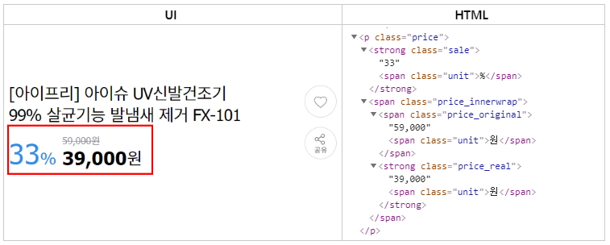
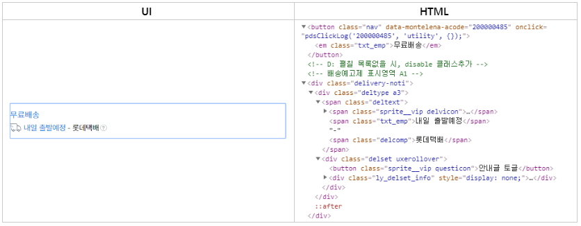
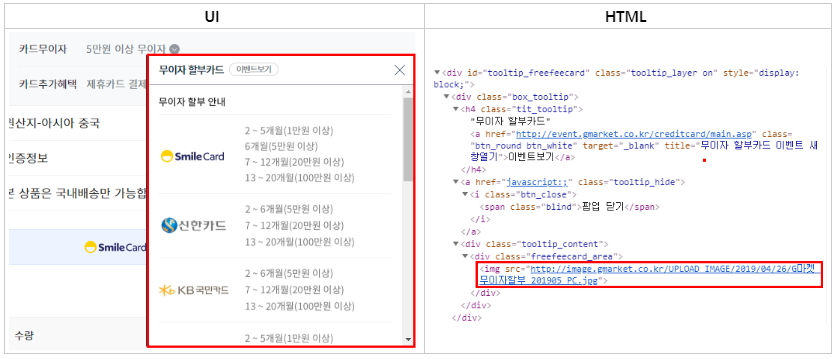
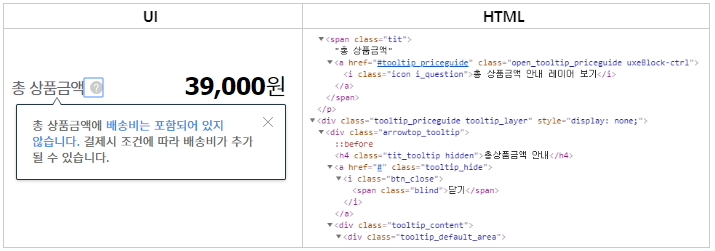
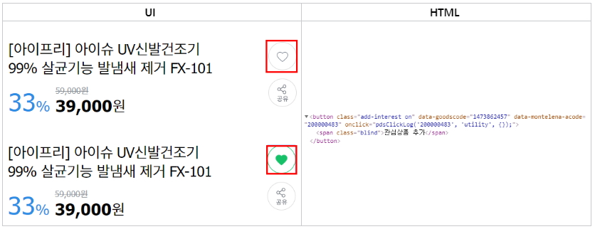
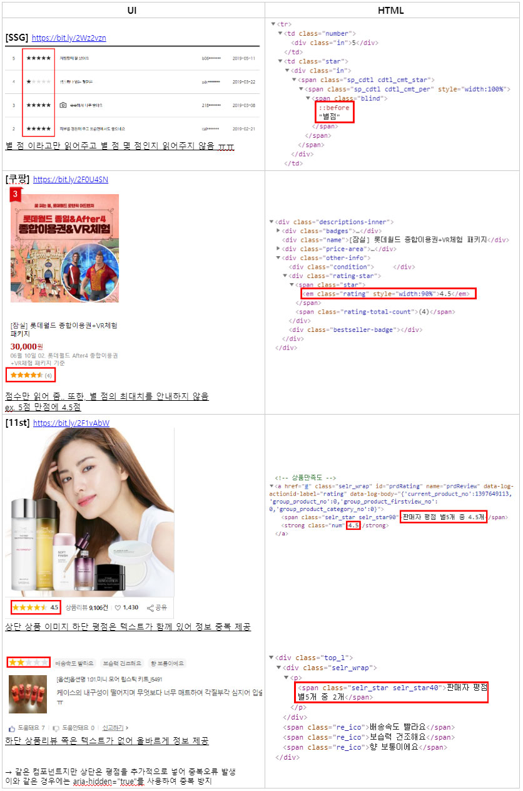
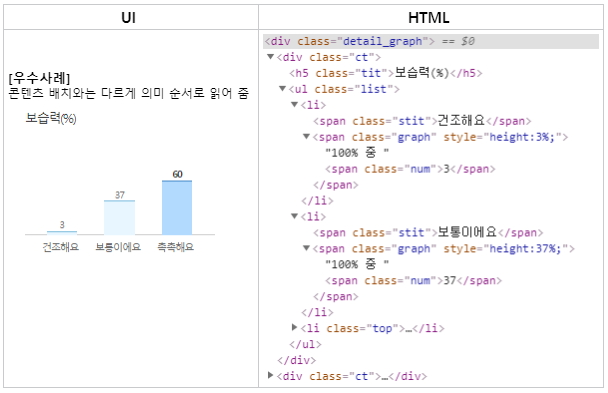

# [세미나] 2019년 정보접근성 오픈 아카데미

* 일시 : 2019년 6월 7일
* 주제 : 국내 쇼핑몰 접근성 관련 이슈

## 보조기기로 쇼핑몰 상품 상세 페이지 탐색하기

* 가장 처음 페이지 제목 탐색 후 본문 바로가기로 본문으로 이동 후 아래 방향키로 탐색
* 주로 헤딩을 따라 탐색하기 때문에 헤딩태그를 잘 넣어주는 것이 중요
* 대부분의 오류 UI는 gmarket 페이지를 예시로 설명 (https://bit.ly/2XAxmrL)

## UI 별 오류사항

### 가격 UI
**[문제] 정상가, 할인가, 할인율을 따로 읽어주지 않음**

* 취소선이 `text-decoration`으로 표현되어 있어 스크린 리더가 따로 읽어주지 않음!
* `del, s` 태그를 보조기기는 인식하지 않기 때문에 부적절 
* 보조기기를 위하여 가격 정보를 정상가, 할인가를 숨김 텍스트로 제공하는 것이 가장 좋음 (ex. 11번가) 
* `display:none, visibility:hidden` 사용하지 말고 숨김 텍스트로 처리

### 운용되지 않는 버튼  UI 
**[문제] 무료배송 버튼이 운용되지 않는데 버튼으로 제공되어 있음**

* 버튼을 운용해도 별다른 동작을 하지 않음
* span이나 div 태그를 사용하여 운용되지 않는 요소는 클릭되지 않도록 해야함
* 소스를 보면 log를 쌓기 위한 용도인 것 같음으로 button 태그로 제공할 필요가 없음

### 토글 버튼  UI 
**[문제] 카드할인, 무이자할부, 카드추가혜택 열기 버튼은 토글 기능을 하고 있지만 버튼 안내 문구가 모호하고, 토글 된 상태에서 버튼 문구가 열기에서 바뀌지 않고 있음**

* '열기' 버튼 이라는 워딩 → '펼치기' 라는 워딩이 적절
* '열기' 버튼 이후, '닫기, 접기' 로 문구를 바꿔주어야 함
* 센스리더는 `display:none/block`이 일어날 경우 페이지 열림이라고 읽어줌 (센스리더 오류인 것 같음)
따라서 `aria-expanded`를 사용하여 굳이 텍스트로 사용하지 않고 정보를 제공하는 방식을 추천 (aria 적극 활용)
* 센스리더는 지원 X, 조만간 될 듯

### 툴팁  UI  
**[문제] 대체 텍스트를 제공하지 않은 툴팁 레이어**

* `display:none/block`이라 '이벤트보기 새 창 열림' 이라고 읽어줌
* '이벤트 보기' 버튼도 워딩이 모호하고, 이벤트 보기라는 정보가 중복 제공되고 있음
* 이미지로 되어있는데 대체 텍스트를 제공하지 않아 보조기기 이용자들은 할부 카드 정보를 인식할 수 없음
* 카드 이벤트보기 페이지로 이동해서 카드 안내 테이블을 탐색해도 이미지로 되어 있어 정보를 절.대.알.수.없.음

**[문제] 총 상품금액 보기 '링크'**

* '총 상품금액 보기'라고 대체 텍스트가 제공되어 있는데, 포커스 이동으로 접근 했을 때 레이어가 열려 있음
→  '이미 열려 있음' (레이어가 열린 상태)를 대체 텍스트로 제공하거나, 사용자가 레이어를 열 수 있도록 동작을 제어할 수 있도록 해야함. 또한, 보기라는 워딩보단 펼치기라는 워딩이 더 맞다고 함
* 이와 같이 `onfocus()`로 기능을 구현한다면, 스크린 리더는 갱신속도가 있기 때문에 펼쳐지고 지나가 버리면 스크린 리더는 읽지 못하고 시각적으로 확인만 가능한 레이어가 되어 버림
* 링크로 제공하면 다른 페이지로 이동하는 것으로 인식하기 때문에 button 태그로 제공하는 것이 좋음 
* 버튼이라면 사용자가 열 수 있도록 제공하는 것이 좋다.
* `role="tooltip"`을 제공하던가, 자동으로 열리는 레이어라면 `aria-describedby`를 사용하여 연결해주는 것이 바람직하다  
* 화면을 확대해서 사용하는 경우 마우스오버로 기능을 탐색하기 어렵다 레이어까지 마우스 오버 기능을 넣어주어 화면 확대 시에도 레이어의 내용을 확인 할 수 있도록 제공해야 함

### 관심상품 추가버튼  UI  
**[문제] 관심상품 추가 버튼계속 추가를 해도 관심상품 추가 버튼이라고 버튼의 텍스트가 바뀌지 않음**

* 버튼이 운용될 경우 `.ly_interest` 레이어가 노출되며 시각적으로 버튼의 상태를 알려주지만 보조기기는 읽어주지 않음
* 현재 상태 정보와 어떤 기능을 할 지 알려줘야 함
* `aria-pressed`를 사용하여 버튼의 상태를 알려주는 것을 권장 (https://mzl.la/2KCOf1v)
* 센스리더는 지원 X, 될 가능성은 없음
* 참고할 사이트 : 다음 뉴스 공감 (현재 공감 수와 공감 하기/취소를 알려줌) 버튼 참고, 또한 버튼의 명도대비도 중요 (https://entertain.v.daum.net/v/20190607120237051?f=p)

### 위메프 상품 상세 페이지 (https://bit.ly/2IuNJ30) 
**[문제] `ㅣ` 로 마크업 하여 스크린 리더로 읽음**

* '이'로 읽혀 숫자/한자/영어 이 인지 알 수 없고 불필요한 텍스트가 읽힘 
* `aria-hidden="true"`로 읽히지 않게 제공하던가, border로 그려주는 등 다른 방법 탐색 필요 
* `' ㅣ '` 로 한 이유는.. 이렇게 해야 양 측 간격이 같아서 였다고 한다!

### 별 점 UI

### 그래프 UI (https://bit.ly/2F1vAbW)

### 간편결제 UI (https://escrow.gmarket.co.kr/ko/order?orderIdx=149ffd74f&itemNo=1473862457&Entrance=PAY&Entrance=PAY)
**[문제] span으로 선택되기 때문에 카드 선택 기능이 없고 다음 버튼을 운용해도 카드를 선택할 수 없음**

* 이전/다음 버튼으로 카드를 선택하게 되어 있음 하지만, 카드가 중앙에 와야 선택이 되도록 구현되어 있음
* 이전/다음 버튼으로 운용했을 때 선택된 카드를 `role="alert"`을 사용해서 어느 카드가 선택되었는지 알려줘야 함
* 카드 닉네임만 들리고, 카드를 읽어주지 않음 
* '은행 / 카드사 명'이라고 제공된 대체 텍스트를 카드회사 명으로 바꿔주는 것이 많음
* wai-aria carousel을 사용하여 개선할 필요가 있음 (참고 : https://www.slideshare.net/jeehoon/ui-carousel)
* 결제화면 중 PIN 넘버 운용 화면은 숫자 버튼에 대체 텍스트도 없고, input에 접근 시 focus도 사라짐
    * 구현 사례가 있음 : kakao pay (앱 뷰로 결제를 넘기고 웹에서 결제하지 않음)
    * **몇 개 중에 몇 개 입력됨** 대체 텍스트 제공
    * 버튼에 대한 대체 텍스트 제공
    * 간편결제 중에 시각장애인이 사용할 수 있는 것은 카카오페이, 네이버 페이, 삼성페이
        * 카카오 페이 : IOS만 제공 (웹에서는 결제가 진행되지 않음)
        * 네이버 페이 : 모바일 환경에서는 제공
        * 삼성페이 : 카드 등록이 문제 